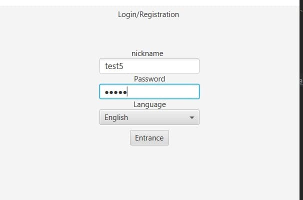
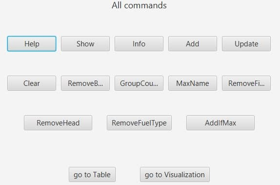
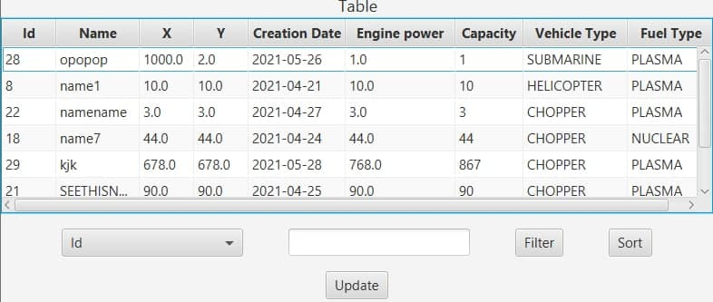
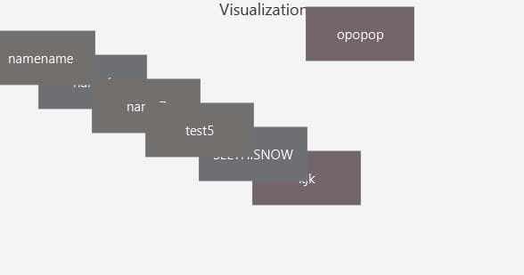

## Desktop client-server application
___
Here is the Backend part of my desktop application

[Link to the Frontend](https://github.com/Nikolay-Gonichenko/Laba8_Client)

Fronted is implemented with __JavaFX__

The application allows to interact with collection of objects. On first page users have to sign in.
Also users can choose the language. 

After authorization users see actions which is allowed for changing data in collection.

On page "table" users see all objects from all users. On this page users may also update their objects, sort objects in some order or filter data in the table.

On Visualisation page users see all objects. They can click on rectangle and change their objects.

For multiplayer interaction I realised __multithreading__ in this project. 

The connection between client and server is implemented with __TCP protocol__.

For saving all data I used __JDBC and PostgreSQL.__
